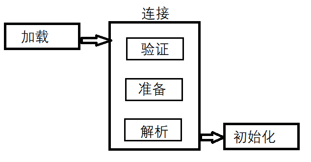
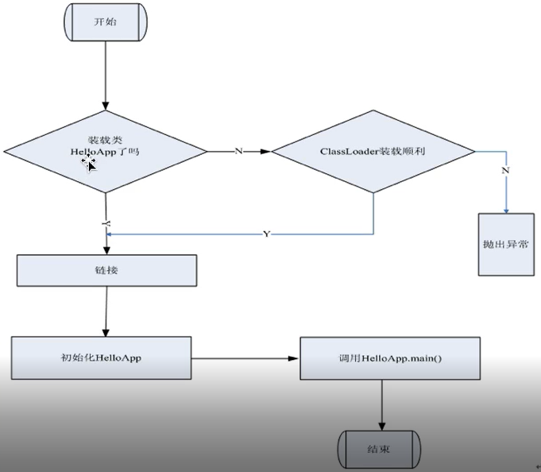
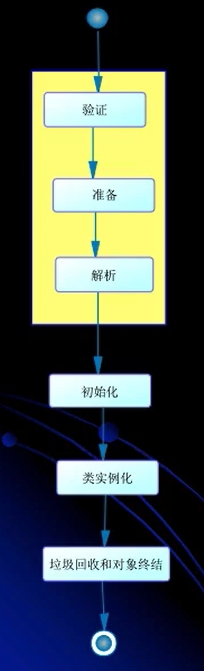
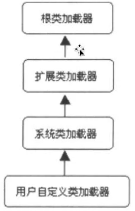
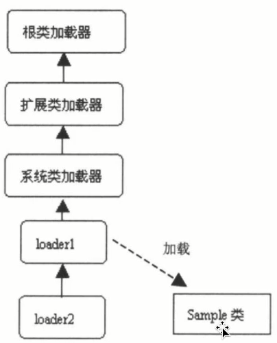
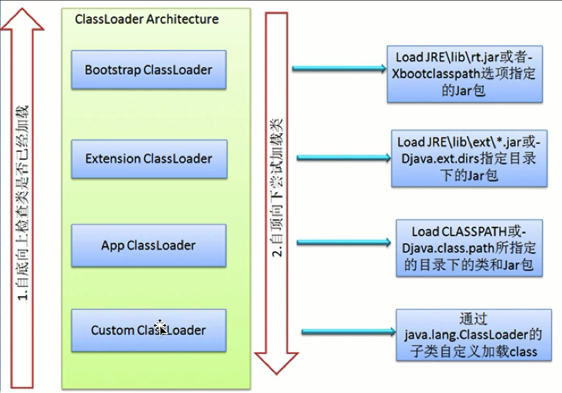

#  一）类加载
- 在 Java 代码中，类的***加载、连接***和***初始化***过程都是在程序运行期间完成的。

	这里的类指class、interface、枚举等本身
	
-  提供了更大的灵活性，增加了更多的可能性

#  二）虚拟机与程序的生命周期

## 在如下几种情况下，Java 虚拟机将结束生命周期

- 执行了 System.exit() 方法；

- 程序正常执行结束；

- 程序在执行过程中遇到了异常或错误而异常终止；

- 由于操作系统出现错误而导致虚拟机进程终止；

#  三）类的加载、链接与初始化

- 加载：查找并加载类的二进制数据；

- 连接：

	- 验证：确保被加载的类的正确性。确保字节码没有被篡改，符合jvm规范。关于class格式后面内容介绍。

	- 准备：为类的***静态变量***分配内存，并将其初始化为默认值。
	
	```java
     // 该语句在准备阶段对变量进行初始赋值，因为是整型所以初始赋值为 0，然后在初始化阶段重新赋值为 1；
     static int a = 1;
     ```

	- 解析：把类中的符号引用转换为直接引用

	- 初始化：为类的静态变量赋予正确的初始值
	

# 四）类的使用和卸载

类的数据结构在内存中驻留

# 五）类的加载、连接与初始化详细

- Java 程序对类的使用方式可分为两种：主动使用和被动使用；

	- 主动使用
	- 被动使用
- 所有的 Java 虚拟机实现必须在每个类或接口被 Java 程序首次主动使用时才能初始化他们

- 主动使用（七种）
    - 使用 new 关键字创建类的实例
    - 访问某个类或接口的静态变量 ，或者对该静态变量赋值
    - 调用类的静态方法；
    - 反射（例如使用`Class.forName(“com.test.Test”)`）
    - 初始化一个类的子类，就会触发父类的初始化；
    - Java 虚拟机启动时被标明启动类的类 ：即包含 main 方法的类；
    - JDK1.7 开始提供的动态语言支持（了解）

- 除了上面七种情况外，其他使用Java类的方式都被看做是对类的被动使用，都不会导致类的初始化

- 类的加载

	类的加载指的是将类的 .class 文件中的二进制数据读入到内存中，将其放在运行时数据区的方法区内，然后在内存中创建一个 java.lang.Class 对象（ JVM 规范并未说明 Class 对象位于哪里，HotSpot 虚拟机将其放在方法区中）用来封装类在方法区内的数据结构。一个类不管生成多少实例，所有实例对应的 Class 对象只有一份。

- 加载 .Class 文件的方式
	- 从本地系统中直接加载
	- 通过网络下载 .class 文件
	- 从 zip，jar 等归档文件中加载 .class 文件
	 - 从专用数据库中提取 .class 文件（很少使用）
	- 将 Java 源文件动态编译为 .class 文件（一般存在于动态代理，因为动态代理的类是运行时候才产生，编译的时候是没有的）

- 类加载图

 

	- 加载：就是把二进制形式的java类型读入java虚拟机中
	- 验证:
	- 准备：为类变量分配内存，设置默认值。但是再到达初始化之前，类变量都没有初始化为真正的初始值
	- 解析：解析过程就是再类型的常量池中寻找类、接口、字段和方法的符号引用，把这些符号引用替换成直接引用的过程
	- 初始化：为类变量赋予正确的初始值

	- 类的实例化
		- 为新的对象分配内存
		- 为实例变量赋默认值
		- 为实例变量赋正确的初始值
		- java编译器为它编译的每一个类都至少生成一个实例初始化方法，在Java的class文件中，这个实例初始化方法被称为“<int>”。 针对源代码中每一个类的构造方法，java编译器都会产生一个“<int>”方法

- 类的加载
	- 类加载器并不需要等到某个类被“首次主动使用”时再加载它
	
	- JVM规范允许类加载器在预料某个类将要被使用时就预先加载它，如果在预先加载的过程中遇到了.class文件缺失，或者存在错误， 类加载器必须在程序首次主动使用该类时才报告错误（LinkageError错误）
	- 如果这个类一直没有被程序主动使用，那么类加载器就不会报告错误

- 类的验证
	- 类被加载后，就进入连接阶段。连接就是将已经读入到内存的类二进制数据合并到虚拟机的运行时环境中区。

	- 类的验证内容
		-类文件的机构检查
		-语义检查
		-字节码验证
		-二进制兼容性验证

- 类的初始化
	- 在初始化阶段，Java虚拟机执行类的初始化语句，为类的静态变量赋予初始值。
	- 在程序中，静态变量的初始化有两种途径：
　　		1.在静态变量的声明处进行初始化；
		2.在静态代码块中进行初始化。
　　	- 没有经过显式初始化的静态变量将原有的值。
- 类的初始化步骤
	- 假如这个类还没有被加载和连接，那就先进行加载和连接
	- 假如类存在直接父类，并且这个类还没有被初始化，那就先初始化直接父类
	- 假如类中存在初始化语句，那么就依次执行这些初始化语句

- 类的初始化时机
	- 当Java虚拟机初始化一个类的时候，要求它的所有的父类都已经被初始化，但这条规则并不适用于接口

		- 在初始化一个类时，并不会先初始化它所实现的接口
		- 在初始化一个接口时，并不会先初始化它的父接口

		因此，一个父接口并不会因为它的子接口或者实现类的初始化而初始化，只有当程序首次使用特定接口的静态变量时，才会导致该接口的初始化

	- 调用ClassLoader类的loadClass方法加载一个类，并不是对类的主动使用，不会导致类的初始化
	
- 类加载器
	- 类加载器用来把类加载到Java虚拟机中。从JDK1.2版本开始，类的加载过程采用父亲委托机制，这种机制能更好地保证Java平台的安全。在此委托机制中，除了Java虚拟机自带的根类加载器（没有父加载器）以外，其余的类加载器都有且只有一个父加载器。当Java程序请求加载器loader1加载Sample类时，loader1首先委托自己的父加载器去加载Sample类，若父加载器能加载，则有父加载器完成加载任务，否则才由加载器loader1本身加载Sample类。

- 有两种类型的类加载器（类一定是由类加载器进行加载）
	- Java虚拟机自带的加载器
		- 根类加载器（Bootstrap）：该加载器没有父加载器，它负责加载虚拟机中的核心类库。根类加载器从系统属性sun.boot.class.path所指定的目录中加载类库。类加载器的实现依赖于底层操作系统，属于虚拟机的实现的一部分，它并没有继承java.lang.ClassLoader类。
		
		- 扩展类加载器（Extension）：它的父加载器为根类加载器。它从java.ext.dirs系统属性所指定的目录中加载类库，或者从JDK的安装目录的jre\lib\ext子目录（扩展目录）下加载类库，如果把用户创建的jar文件放在这个目录下，也会自动由扩展类加载器加载，扩展类加载器是纯Java类，是java.lang.ClassLoader的子类。
		
		- 系统应用类加载器（System）：也称为应用类加载器，它的父加载器为扩展类加载器，它从环境变量classpath或者系统属性java.class.path所指定的目录中加载类，他是用户自定义的类加载器的默认父加载器。系统类加载器时纯Java类，是java.lang.ClassLoader的子类。

	- 用户自定义的类加载器

		- 特点：一定是java.lang.ClassLoader的子类
		- 作用：用户可以定制类的加载方式

	

 

- 类加载器的父亲委托机制
	- 在父亲委托机制中，各个加载器按照父子关系形成了‘逻辑上的’树形结构，除了根类加载器之外，其余的类加载器都有且只有一个父加载器
	
	- 若有一个类加载器能够成功加载Test类，那么这个类加载器被定义为定义类加载器，所有能成功返回Class对象引用的类加载器包括定义类加载器都被称为初始类加载器
	 
	 
	
1）Bootstrap ClassLoader
	负责加载$JAVA_HOME中jre/lib/rt.jar里所有的class，由C++实现，不是ClassLoader子类
	
2）Extension ClassLoader
	负责加载java平台中扩展功能的一些jar包，包括$JAVA_HOME中jre/lib/*.jar或-Djava.ext.dirs指定目录下的jar包
	
3）App ClassLoader
	负责记载classpath中指定的jar包及目录中class
	
4）Custom ClassLoader
	属于应用程序根据自身需要自定义的ClassLoader，如tomcat、jboss都会根据j2ee规范自行实现ClassLoader

- 获得ClassLoader的途径

	- 获得当前类的ClassLoader

		clazz.getClassLoader();

	- 获得当前线程上下文的ClassLoader

		Thread.currentThred().getContextClassLoader();

	- 获得系统的ClassLoader

		ClassLoader.getSystemClassLoader();

	- 获取调用者的ClassLoader
	
		DriverManager.getCallerClassLoader();

# 四）命名空间
- 每个类加载器都有自己的命名空间，==命名空间由该加载器及所有父加载器所加载的类构成==；
- 在同一个命名空间中，不会出现类的完整名字（包括类的包名）相同的两个类；
- 在不同的命名空间中，有可能会出现类的完整名字（包括类的包名）相同的两个类；（可以被加载多次）

# 五）类的卸载
- 当一个类被加载、连接和初始化之后，它的生命周期就开始了。当此类的Class对象不再被引用，即不可触及时，Class对象就会结束生命周期，类在方法区内的数据也会被卸载。

- 一个类何时结束生命周期，取决于代表它的Class对象何时结束生命周期。

- 由 Java 虚拟机自带的类加载器所加载的类，在虚拟机的生命周期中，始终不会被卸载。Java 虚拟机本身会始终引用这些加载器，而这些类加载器则会始终引用他们所加载的类的 Class 对象，因此这些Class对象是可触及的。

- 由用户自定义的类加载器所加载的类是可以被卸载的

